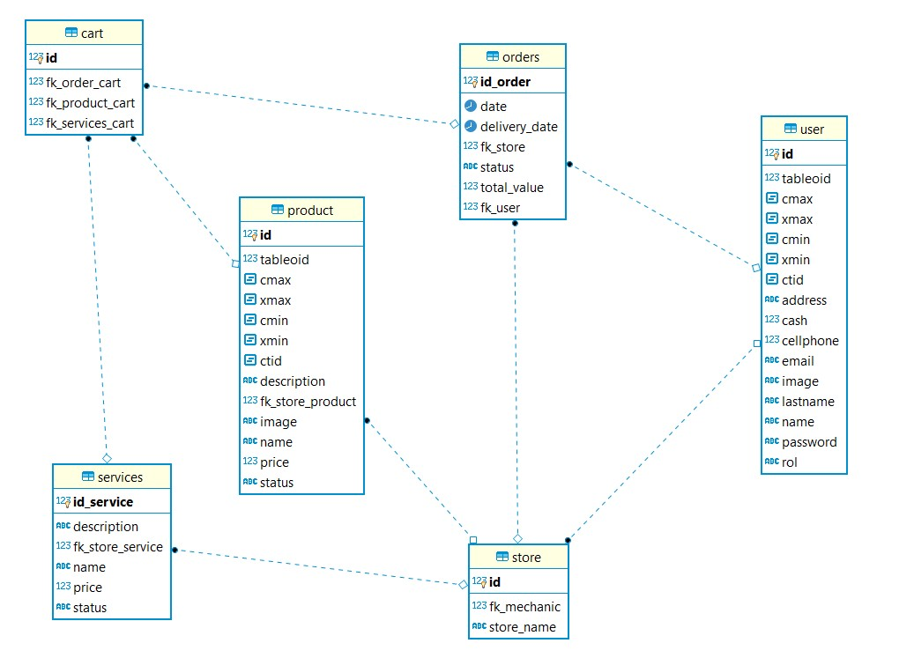
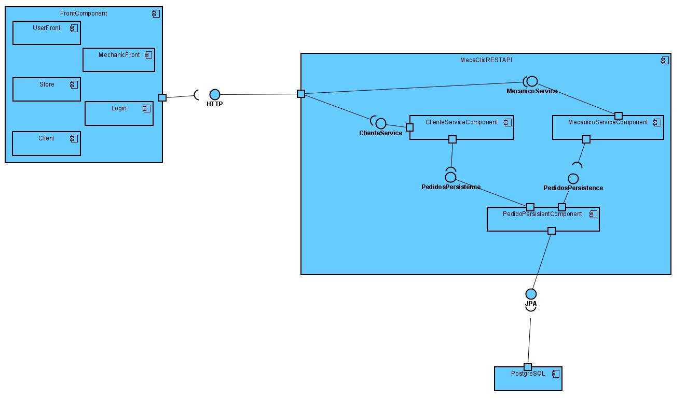
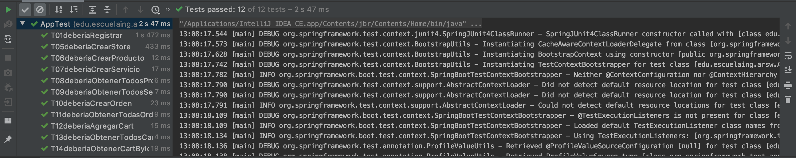

# MecaClick

## Integrantes
- Santiago Lopez Osorio
- Juan Muñoz Delgadillo
- Brayan Felipe Rojas 

## Despliegue, Analisis de codigo e integración continua:

## Descripcion
El objetivo de la aplicación es conectar a proveedores de servicios automotrices y a sus clientes para que los clientes puedan consumir sus productos y servicios desde la comodidad de sus casas, la aplicación permitirá ver todos los proveedores y los servicios y productos que ofrecen. La aplicación permitirá que cuando se pida un servicio se chatee con el proveedor para ultimar detalles o para aclarar cualquier duda que tenga el cliente.

## Diagrama de clases:

## Diagrama de Base de Datos:

## Diagrama de Componentes:

## Diagrama de Despliegue:

## Historias de Usuario:

* Como mecanico 
Quiero Agregar y modificar productos
Para Poder tener un catalogo mas amplio y actualizado 

* Como Mecanico
Quiero ver mis ordenes 
Para poder saber cuantos he hecho y cuales podre hacer o no 

* Como Mecanico 
Quiero Ver ganancias obtenidas 
Para Poder Saber si he mejorado mis ganancias con ayuda de la app

* Como: Usuario registrado.
Quiero: Realizar una cotización de un servicio.
Para: Elegir el servicio de preferencia.
* Como Usuario registrado
Quiero  Pedir un servicio 
Para Poder Solucionar un problema de mi auto o moto 
* Como Usuario Registrado 
Quiero Calificar un servicio
Para Poder realizar una retroalimentacion.
* Como Usuario Registrado.
Quiero saber el historial de servicios
Para: Poder tener un listado de los servicios que he pedido

## Pruebas Unitarias

## Requerimiento No Funcional 
### Prueba de Carga con JMeter
> JMeter es una herramienta que nos permite realizar pruebas de carga para analizar y medir el rendimiento de una variedad de servicios, con enfasis en aplicaciones web.
- A continuacion mostramos una tabla con los datos analizados arrojados por la aplicacion y una grafica que nos indica el comportamiento de la aplicacion ante las diferentes peticiones realizadas por los usuarios en un minuto.

## Manual de Usuario
Para ver el manual de Usuario para la aplicacion MecaClick, click [Acá](https://github.com/sfjwarriors/warriors/blob/master/ManualDeUsuario.md)
## Mockups
Para ver los mockups click [Aqui](https://github.com/sfjwarriors/warriors/blob/master/Mockups.pdf)
